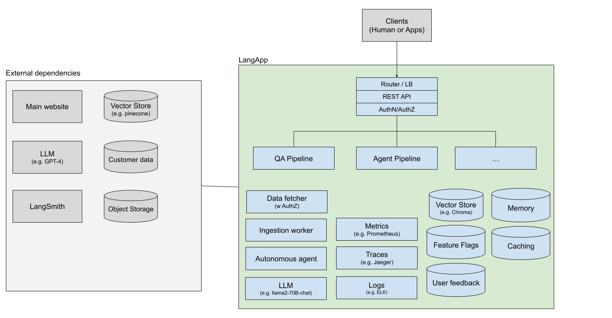

# This repo is still DRAFT

# 🦜️🖼️ LangApp

LangApp is an open-source web application framework for production-grade LLM applications.

Creating your first LLM application by forking an example project found on Internet is easy,
however, running it on production requires a lot more effort.
For example, you need proper authentications, authorizations, database migrations,
performance optimization, scalable architecture, secure codebase,
maintainable codebase, async workers, cron workers, observability, telemetry,
dependency management, A/B testing, feature flags, and so on.

LangApp guides you to build such application with the harness of [LangChain](https://github.com/langchain-ai/langchain) and [LangSmith](https://docs.smith.langchain.com/).

## Key features

### Pipeline Interfaces

[Chains](https://docs.langchain.com/docs/components/chains/) is an incredibly generic concept which returns to a sequence of modular components (or other chains) combined in a particular way to accomplish a common use case.
Applications provide the interfaces for interacting with [chains](https://docs.langchain.com/docs/components/chains/) via HTTP requests.

Path formats:

```
POST /api/v1/pipelines/<name> ... Execute a chain
POST /api/v1/pipelines/<name>/feedback ... Post feedback for the chain
```

[“Agents”](https://docs.langchain.com/docs/components/agents/) are essentially subclasses of the chains, therefore it's provided by the same interface.

For more information, see [Developments](docs/developments.md).

### Versioning and composability

Pipelines, which is the definition of data flow, are versioned and immutable.
LangApp compiles the code into a docker image and tag it with a version number.
You can later strategies how these versions should be handled on production, such as,
deploying to the latest version, canary deployment, A/B testing, etc.

Pipelines are defined in the YAML file to make it composable and reusable.

### Kubernetes

LangApp is designed for Kubernetes as the production platform.



[source](https://docs.google.com/drawings/d/1ushZBAtNDY6EvABnaeKfAA0WWrCmXl_qMfTjGusjS3k/edit?usp=sharing)

## How to start

Here is how to start a new project with LangApp, and run it on docker-compose.

For more information, see [Deployment doc](docs/deployments.md).

## Principles

- Convention over Configuration (CoC) ... It provides sensible defaults and conventions for naming and structuring code and database tables.
- Don't Repeat Yourself (DRY) ... Aiming to minimize redundancy in code by promoting code reuse and modularity.
- RESTful Routing: It promotes the use of RESTful (Representational State Transfer) routes, which correspond to the standard HTTP methods (GET, POST, PUT, DELETE) and make it easier to interact with [chains](https://docs.langchain.com/docs/components/chains/) and [agents](https://docs.langchain.com/docs/components/agents/).
- Scaffolding: It provides a command called "scaffold" that generates boilerplate code for creating a basic [chain](https://docs.langchain.com/docs/components/agents/) or [agent](https://docs.langchain.com/docs/components/agents/) interface, helping developers get started quickly.
- Testing and evaluations: It encourages and makes it easy to write integration tests for your chains and agents, promoting test-driven development (TDD).
- Auto Scale: When a request volume increases, the chain/agent instances will automatically scale up.
- Cost efficient: When a request volume decreases, the chain/agent instances will automatically scale down.

## Key Dependencies

- Python 3.7+
- [LangChain](https://github.com/langchain-ai/langchain): Building applications with LLMs through composability.
- [LangSmith](https://github.com/langchain-ai/langsmith-sdk): Observability for chains and agents.
- [FastAPI](https://github.com/tiangolo/fastapi): FastAPI is a modern, fast (high-performance), web framework for building APIs with Python 3.7+ based on standard Python type hints.
- (TBD) [Sqlalchemy](https://www.sqlalchemy.org/): The Python SQL toolkit and Object Relational Mapper that gives application developers the full power and flexibility of SQL.
- (TBD) [Alembic](https://alembic.sqlalchemy.org/en/latest/): Alembic is a lightweight database migration tool for usage with the SQLAlchemy Database Toolkit for Python.
- (TBD) [Celery](https://github.com/celery/celery): Distribute work across threads or machines, a.k.a. workers.
- (TBD) [Redis](https://github.com/redis/redis): Caching and manage job queues.

## Further details

- [Developments](docs/developments.md)
- [Deployments](docs/deployments.md)
- [Observability](docs/observability.md)
- [Evaluations](docs/evaluations.md)
- [Contributions](docs/contributing.md)
- [License](LICENSE)
